1. Создайте виртуальную машину Linux.

vagrant up

2. Установите ufw и разрешите к этой машине сессии на порты 22 и 443, при этом трафик на интерфейсе localhost (lo) должен ходить свободно на все порты.

* sudo ufw allow ssh
* sudo ufw allow https
* sudo ufw allow out on lo
* sudo ufw allow in on lo
* sudo ufw enable

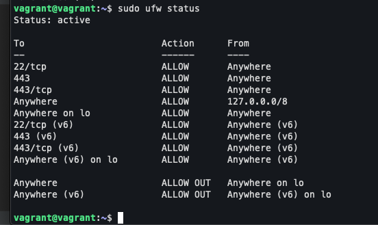

3. Установите hashicorp vault (инструкция по ссылке).

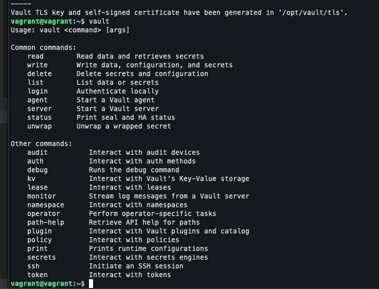

4. Cоздайте центр сертификации по инструкции (ссылка) и выпустите сертификат для использования его в настройке веб-сервера nginx (срок жизни сертификата - месяц).

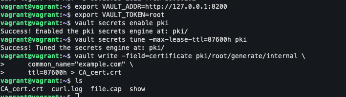
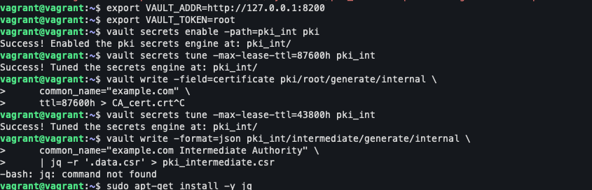
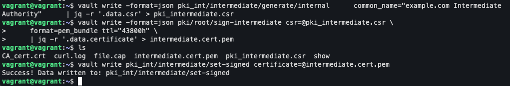
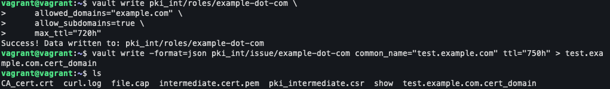

5. Установите корневой сертификат созданного центра сертификации в доверенные в хостовой системе.

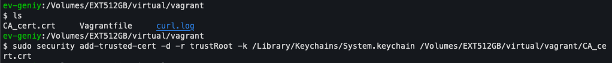
   
6. Установите nginx.

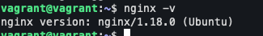

7. По инструкции (ссылка) настройте nginx на https, используя ранее подготовленный сертификат:
можно использовать стандартную стартовую страницу nginx для демонстрации работы сервера;
можно использовать и другой html файл, сделанный вами;
   
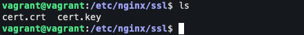

server {
	listen 443 ssl;
	server_name test.example.com;
	ssl_certificate	/etc/nginx/ssl/cert.crt;
	ssl_certificate_key /etc/nginx/ssl/cert.key;
...

8. Откройте в браузере на хосте https адрес страницы, которую обслуживает сервер nginx.
   
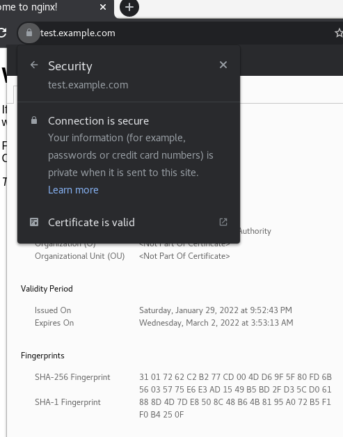

9. Создайте скрипт, который будет генерировать новый сертификат в vault:
генерируем новый сертификат так, чтобы не переписывать конфиг nginx;
перезапускаем nginx для применения нового сертификата.
   
```bash
#!/usr/bin/env bash

cert_data=/home/vagrant/cert.json

export VAULT_ADDR=http://127.0.0.1:8200
export VAULT_TOKEN=root

vault write -format=json pki_int/issue/example-dot-com common_name="test.example.com" ttl="750h" > $cert_data

cat $cert_data | jq -r .data.certificate > /etc/nginx/ssl/test.example.com.crt
cat $cert_data | jq -r .data.issuing_ca >> /etc/nginx/ssl/test.example.com.crt
cat $cert_data | jq -r .data.private_key > /etc/nginx/ssl/test.example.com.key

sudo service nginx restart

rm $cert_data
```

10. Поместите скрипт в crontab, чтобы сертификат обновлялся какого-то числа каждого месяца в удобное для вас время.

```
#раз в месяц
1 0 1 * * /home/vagrant/update_certificate.sh
```

```
#раз в минуту для эксперимента
1 * * * * /home/vagrant/update_certificate.sh
```

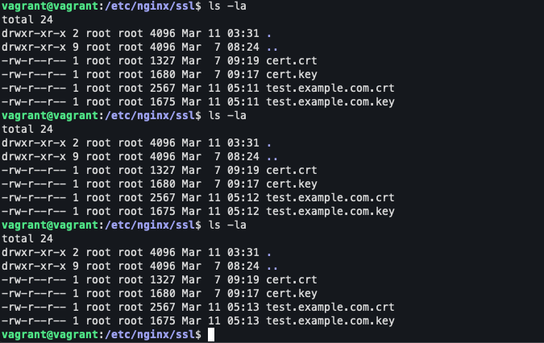


